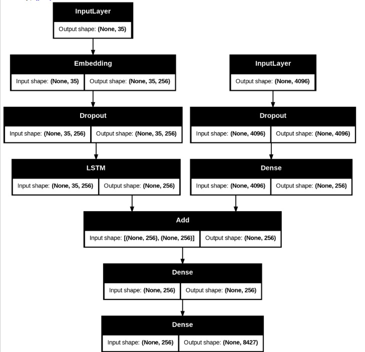
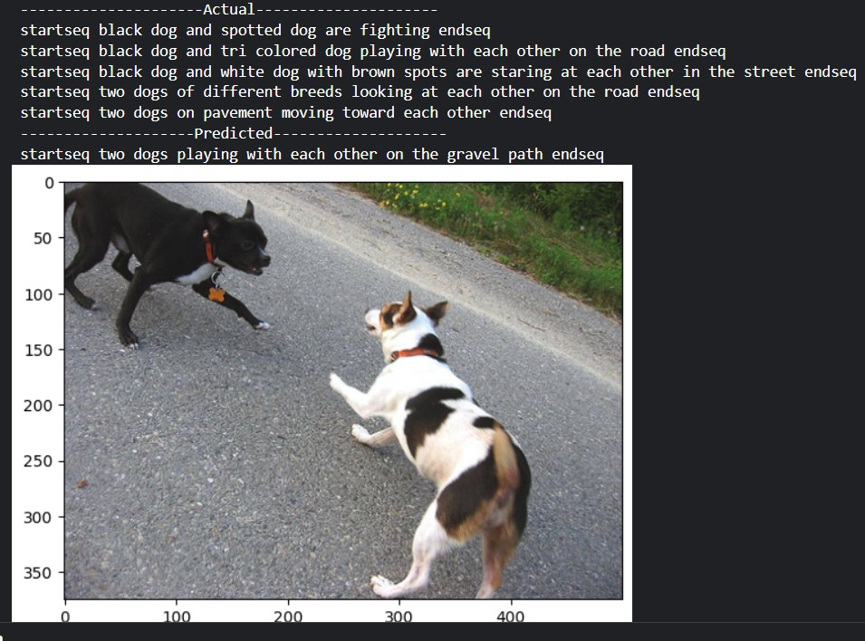
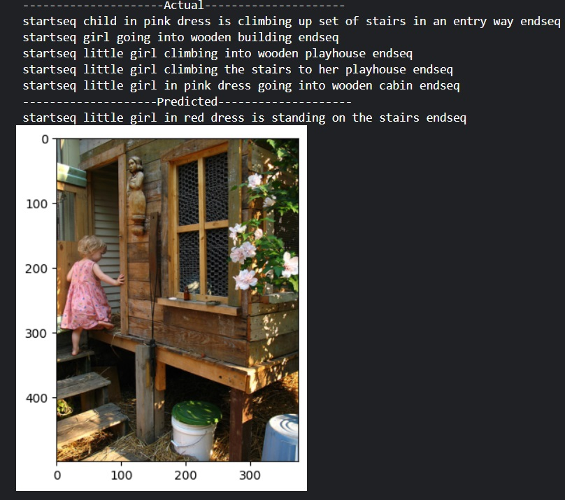

# Image-Captioning-Using Cnn and Lstm
A Image Captioning  Model
# Image Caption Generation with Deep Learning


A sophisticated deep learning system that automatically generates natural language descriptions for images using an encoder-decoder architecture with attention-like fusion mechanisms.

## 🏗️ Architecture Overview

This implementation employs a **multimodal encoder-decoder architecture** that bridges computer vision and natural language processing:

|  

### Why This Architecture Works

**1. Complementary Modalities**
- **Visual Features**: Capture spatial patterns, objects, scenes, and relationships
- **Textual Features**: Encode semantic context, grammar, and linguistic structure
- **Fusion**: Combines both modalities to generate contextually relevant descriptions

**2. Transfer Learning Advantage**
- Leverages pre-trained visual representations from ImageNet
- Reduces training time and data requirements
- Provides robust feature extraction without domain-specific training

## 🧠 Component Analysis

### VGG16 Encoder - Visual Feature Extraction

**Architecture Choice**: VGG16 pre-trained on ImageNet
- **Depth**: 16 layers with hierarchical feature learning
- **Feature Dimension**: 4096D dense representation from FC2 layer
- **Receptive Field**: Large enough to capture global image context

**Why VGG16 Works**:
- **Hierarchical Learning**: Early layers detect edges/textures, deeper layers recognize objects/scenes
- **Spatial Invariance**: Convolutional structure handles objects at different positions
- **Rich Representations**: 4096D features encode comprehensive visual information
- **Pre-training Benefits**: ImageNet knowledge transfers well to diverse image domains

### LSTM Decoder - Sequential Text Generation

**Architecture**: Single-layer LSTM with 256 hidden units
- **Memory Mechanism**: Long Short-Term Memory addresses vanishing gradient problem
- **Sequential Processing**: Generates captions word-by-word maintaining context
- **Hidden State**: 256D representation balances complexity and computational efficiency

**Why LSTM is Effective**:
- **Long-term Dependencies**: Remembers relevant information across entire caption sequence
- **Gradient Flow**: Cell state mechanism enables stable training over long sequences
- **Contextual Generation**: Each word is generated considering previous words and image content
- **Flexible Length**: Naturally handles variable-length caption generation

### Fusion Mechanism - Multimodal Integration

**Implementation**: Element-wise addition of visual and textual features
```
decoder_input = visual_features + textual_features
```

**Why Addition Works**:
- **Implicit Attention**: Forces model to learn complementary representations
- **Dimensionality Alignment**: Both streams project to same 256D space
- **Gradient Flow**: Simple operation preserves gradients to both encoders
- **Computational Efficiency**: Lightweight compared to complex attention mechanisms

## 🔧 Technical Implementation Details

### Image Processing Pipeline
- **Preprocessing**: VGG16-specific normalization (ImageNet statistics)
- **Resolution**: 224×224 RGB input (VGG16 requirement)
- **Feature Extraction**: FC2 layer output (pre-softmax dense representation)

### Text Processing Pipeline
- **Tokenization**: Word-level vocabulary with start/end tokens
- **Sequence Encoding**: Integer mapping with padding for batch processing
- **Embedding**: 256D learned word representations
- **Training Strategy**: Teacher forcing with ground truth sequences

### Training Configuration
- **Dataset Split**: 90% training, 10% validation
- **Batch Size**: 32 sequences per batch
- **Epochs**: 20 iterations over dataset
- **Loss Function**: Categorical crossentropy (multi-class word prediction)
- **Optimizer**: Adam with default parameters

## 📊 Model Performance

### Evaluation Metrics
- **BLEU-1**: Measures unigram precision (individual word accuracy)   BLEU-1: 0.547770
- **BLEU-2**: Evaluates bigram precision (phrase-level fluency)       BLEU-2: 0.323294
- **Qualitative Assessment**: Visual inspection of generated captions

### Expected Performance
- Generates syntactically correct captions
- Identifies main objects and scenes accurately
- Produces contextually relevant descriptions
- Handles diverse image categories from Flickr8k dataset

## 🎯 Architectural Advantages

### Strengths
1. **Simplicity**: Straightforward encoder-decoder design
2. **Efficiency**: Moderate computational requirements
3. **Generalizability**: Transfer learning enables broad applicability
4. **Interpretability**: Clear separation of visual and textual processing

### Limitations
1. **No Explicit Attention**: Cannot focus on specific image regions
2. **Fixed Features**: Visual features computed once, not adaptive
3. **Sequential Bottleneck**: LSTM processes words sequentially (not parallelizable)
4. **Limited Context**: 256D hidden state may limit complex scene understanding

## 🚀 Future Enhancements

### Potential Improvements
- **Attention Mechanisms**: Visual attention to focus on relevant image regions
- **Transformer Architecture**: Self-attention for better sequence modeling
- **Beam Search**: Multiple caption candidates for better generation quality
- **Advanced CNN**: ResNet, EfficientNet for improved visual features
- **Multi-scale Features**: Combine features from multiple CNN layers


## 🔬 Project Context

This architecture represents a foundational approach in **Neural Image Captioning**:
- **Era**: Pre-attention mechanisms (2014-2016 methodology)
- **Influence**: Basis for later attention-based and transformer models
- **Significance**: Demonstrates effectiveness of encoder-decoder paradigm for vision-language tasks

## 📚 Dependencies

```python
tensorflow>=2.8.0
keras>=2.8.0
numpy>=1.21.0
pillow>=8.3.0
matplotlib>=3.5.0
nltk>=3.7.0
tqdm>=4.62.0
```
### 🖼️ Predicted Images

output_1:

  
output_2:

  
## Acknowledgments

- **VGG16**: Simonyan & Zisserman (2014)
- **LSTM**: Hochreiter & Schmidhuber (1997)
- **Flickr8k Dataset**: Hodosh et al. (2013)
- **Neural Image Captioning**: Vinyals et al. (2015)

---

**Note**: This project is provided without a license. All rights reserved by the author.